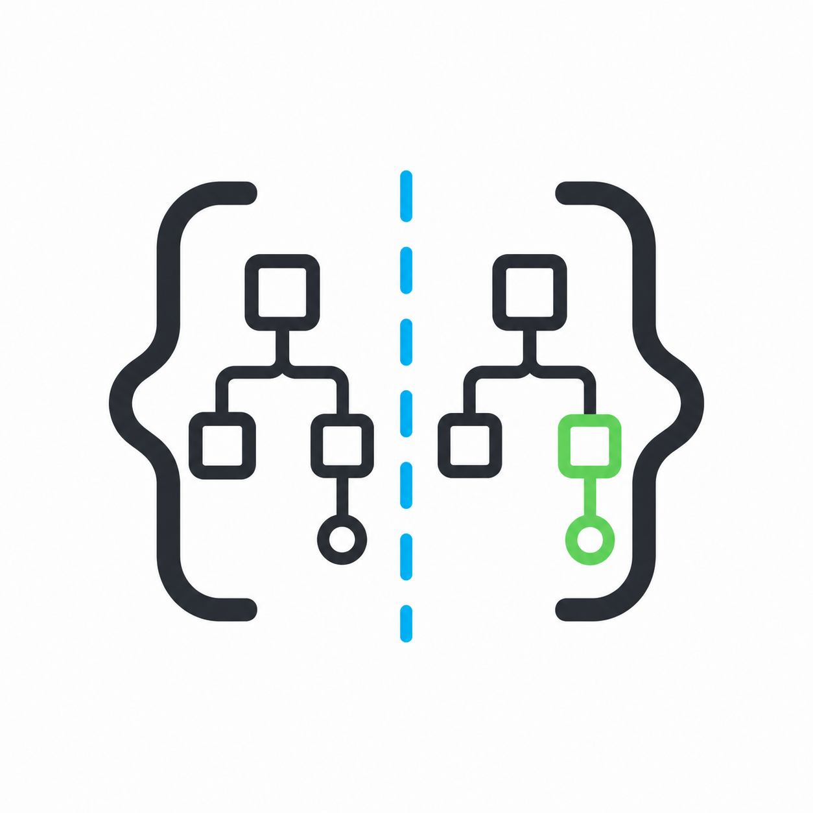

<div align="center">
  

  <h1>CSS-Diff</h1>

  <p>English | <a href="./README.zh-CN.md">简体中文</a></p>

  <p>CSS-Diff is a DevTools sidebar extension for comparing the computed CSS of two DOM elements. It is built for frontend debugging: select two elements in the Elements panel, then inspect what changed, search for a property, and copy a CSS declaration with one click.</p>
</div>

https://github.com/user-attachments/assets/1766e65e-fa31-4095-93d1-f247daa0e8e7

## Why CSS-Diff?

Browser DevTools is excellent at inspecting one element, but finding why two similar elements render differently can still mean switching back and forth between style panes. CSS-Diff puts both computed style results in one table, highlights the differences first, and keeps the workflow inside DevTools.

## Features

- **DevTools Elements sidebar**: adds a `CSS-Diff` pane directly to the Elements panel.
- **Two-element comparison**: select two DOM elements and compare their normalized computed CSS properties.
- **Difference-first table**: changed properties are shown by default, with a `Show all` toggle for the full computed style list.
- **Property search**: filter CSS properties by name while reviewing the comparison.
- **One-click copy**: click a value cell to copy `property: value;`.
- **Native page hover highlight**: hover a source/target DOM line in the diff table to highlight that DOM node in the inspected page, and remove the highlight immediately when the pointer leaves.
- **Cross-window/tab sync**: selected element data is broadcast to other open windows/tabs, which helps compare page states side by side.
- **Localized UI**: includes English and Simplified Chinese browser i18n messages.

## Installation

> [!WARNING]
> CSS-Diff is not currently available in a browser extension store.

Download the packaged zip from [Releases](https://github.com/jevin98/css-diff-devtools/releases), then install or load it manually from your browser's extensions page.

## Chrome Debugger Permission

CSS-Diff requests Chrome's `debugger` permission so the diff table can use the Chrome DevTools Protocol `Overlay.highlightNode` and `Overlay.hideHighlight` commands. This is what makes DOM line hover highlighting appear and disappear immediately in the inspected page.

Chrome treats this permission as sensitive:

- Chrome may show a permission warning when the extension is installed or updated.
- Chrome may show a browser-level notice that CSS-Diff is debugging the current page while the extension is attached.
- CSS-Diff uses this permission only for temporary DOM hover highlighting from the DevTools sidebar.
- If the permission is denied, CSS comparison still works, but native hover highlighting in the inspected page is unavailable.

## Usage

1. Open the page you want to inspect.
2. Open DevTools and switch to the Elements panel.
3. Open the `CSS-Diff` sidebar.
4. Select the first DOM element, then select the second DOM element.
5. Review the highlighted differences, search for a property, or enable `Show all`.
6. Hover a source/target DOM line in the diff table to highlight that DOM node in the inspected page.
7. Click a left/right value cell to copy the CSS declaration.
8. Click `Clear Selection` to start another comparison.

## Local Development

Install dependencies:

```sh
pnpm install --frozen-lockfile
```

Start a development build:

```sh
pnpm dev
```

Other browser targets:

```sh
pnpm dev:firefox
pnpm dev:edge
```

## Build

Build all supported targets:

```sh
pnpm build
```

Build one target:

```sh
pnpm build:chrome
pnpm build:firefox
pnpm build:edge
```

Package extensions:

```sh
pnpm zip
```

## Testing

This project uses Vitest for unit/component tests and Playwright for a built-panel smoke test.

```sh
pnpm test
pnpm test:coverage
pnpm test:e2e
```

- `pnpm test` runs fast Vitest tests for pure CSS diff utilities, DOM style formatting, and the Vue DevTools panel shell.
- `pnpm test:coverage` generates local coverage output under `coverage/`.
- `pnpm test:e2e` builds the Chrome extension first, then serves `.output/chrome-mv3` locally and verifies that the built DevTools panel renders.

## Tech Stack

- [pnpm](https://pnpm.io/) for package management
- [WXT](https://wxt.dev/) for browser extension development
- [Vue 3](https://vuejs.org/) with TypeScript for the DevTools panel UI
- shadcn-vue style local components, [Reka UI](https://reka-ui.com/), and [lucide-vue-next](https://lucide.dev/) for UI primitives and icons
- [Tailwind CSS v4](https://tailwindcss.com/) for styling and design tokens
- `vue-tsc`, [Vitest](https://vitest.dev/), and [Playwright](https://playwright.dev/) for type checking and verification
- WXT/browser `i18n` for localized messages

## Inspiration

- https://github.com/kdzwinel/CSS-Diff

## License

[MIT](./LICENSE.md)
